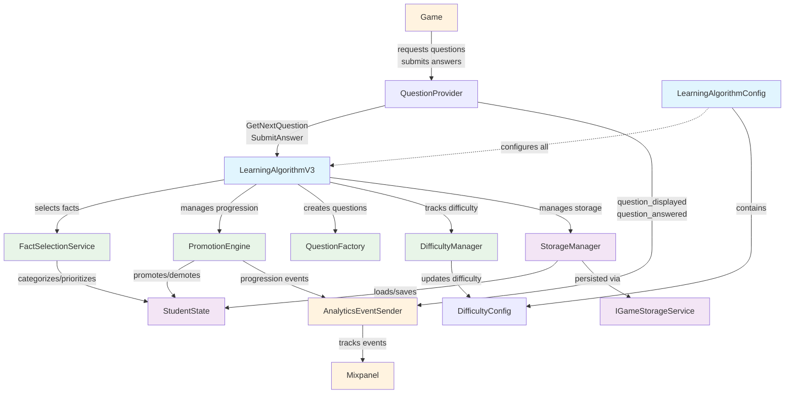

# Learning SDK

## Overview

The Learning SDK implements the learning algorithm described below and provides the necessary infrastructure to integrate it into games. The core components are:

**Learning Algorithm**:

- **`LearningAlgorithmV3`**: The core algorithm that modifies student state and determines the next question to ask. Now features a modular architecture with separate components for fact selection, promotion logic, difficulty management, and question generation.
- **`LearningAlgorithmConfig`**: Configuration object with dynamic difficulty support, including per-difficulty settings for working memory constraints, promotion/demotion thresholds, and bulk promotion rules.
- **`DifficultyManager`**: Manages dynamic difficulty adjustments based on student accuracy, automatically switching between Easy/Medium/Hard configurations.
- **`FactSelectionService`**: Handles fact categorization, working memory constraints, and intelligent fact prioritization.
- **`PromotionEngine`**: Manages individual fact progression, bulk promotion logic, and stage transitions with configurable thresholds.
- **`QuestionFactory`**: Creates questions with appropriate timers and learning modes based on fact and stage.

**Student State & Persistence**:

- **`StudentState`**: Contains individual fact progress, answer history, statistics, and stage progression across fact sets. Now includes enhanced methods for difficulty calculation, bulk promotion analytics, and fact set coverage tracking.
- **`StorageManager`**: Handles persistence of the student state, fact set management, and upfront loading of all facts. Manages the relationship between facts and student progress.
- **`IGameStorageService`**: Low-level storage interface for persisting student state across sessions.

**Question Management**:

- **`QuestionProvider`**: Acts as an adapter between the simple interface that the SDK exposes and the event-based system that games need. Handles question timing, generation, and lifecycle management..

**Analytics Integration**:

- **`AnalyticsEventSender`**: The algorithm can fire arbitrary events of its choosing, plus there are built-in events for showing questions and answering questions. This system handles events from the algorithm and publishes them to the tracking system (Mixpanel) along with standardized events like `question_answered` and `question_displayed`.

### Architecture Diagram

## Learning Algorithm V3

### Main Decisions

- Use a modular architecture with separate services for fact selection, promotion, difficulty management, and question creation.

  - Rationale: Improves maintainability, testability, and separation of concerns while enabling sophisticated algorithm features.

- Implement dynamic difficulty management with automatic adjustment based on student accuracy.

  - Rationale: Personalizes the learning experience by adapting working memory constraints and promotion thresholds to student performance.

- Replace time-window working memory constraints with fact-category based constraints.

  - Rationale: More pedagogically sound approach that respects working memory limits while allowing flexible fact introduction.

- Prioritize oldest facts first for unknown fact selection (null LastAskedTime = highest priority).

  - Rationale: Encourages exploration of the fact space and gradual knowledge building through systematic coverage.

- Make promotion and demotion thresholds configurable per learning stage and difficulty level.

  - Rationale: Enables fine-grained control over progression speed and allows for stage-specific learning requirements.

- Re-implement bulk promotion as an optional feature with configurable conditions.

  - Rationale: Allows for accelerated progression when students demonstrate mastery across a fact set while maintaining individual fact tracking.

- Load all facts from all fact sets upfront with intelligent categorization.

  - Rationale: Enables sophisticated filtering and pool-based selection while supporting working memory constraints.

- Take each fact through seven sequential learning stages: Assessment, Grounding, PracticeSlow, PracticeFast, Review, Repetition, Mastered.

  - Rationale: Provides granular progression control with speed-based practice stages and comprehensive spaced repetition.

- Implement spaced repetition with configurable delays for reinforcement stages.

  - Rationale: Based on learning science research while allowing customization for different learning contexts.

- Use configurable known/unknown fact ratios per difficulty level.

  - Rationale: Allows balancing reinforcement vs. new learning based on student capability and performance.

### Learning Stages

Seven sequential stages with different timing, difficulty, and reinforcement patterns:

1. **Assessment** - Timed, initial evaluation and ongoing assessment
2. **Grounding** - Untimed, blocking questions for struggling concepts
3. **PracticeSlow** - Slower timer, initial speed and accuracy development
4. **PracticeFast** - Faster timer, advanced speed and accuracy development  
5. **Review** - Within-session reinforcement with increasing delays (1min, 2min, 4min)
6. **Repetition** - Cross-session reinforcement with increasing delays (1day, 2day, 4day, 1week)
7. **Mastered** - Facts removed from active pool, fully learned

### Learning Progression System

#### Dynamic Difficulty Management

- **Difficulty Levels**: Easy, Medium, Hard with different constraints and thresholds
- **Automatic Adjustment**: Based on recent answer accuracy (configurable window size)
- **Per-Difficulty Settings**:
  - Working memory limits (MaxFactsBeingLearned)
  - Known/unknown fact ratios (KnownFactMinRatio, KnownFactMaxRatio)
  - Promotion and demotion thresholds per stage
  - Bulk promotion configuration

#### Individual Fact Progression (Primary Mechanism)

- **Configurable Thresholds**: Per-stage promotion and demotion thresholds based on current difficulty
- **Stage Skipping**: Stages with threshold = 0 are automatically skipped
- **Progression Paths**:
  - Assessment + Threshold Correct → PracticeSlow
  - Assessment + Threshold Wrong → Grounding
  - Grounding + Threshold Correct → PracticeSlow
  - PracticeSlow + Threshold Correct → PracticeFast
  - PracticeFast + Threshold Correct → Review
  - Review + Correct (with delays) → Repetition (after all review cycles)
  - Repetition + Correct (with delays) → Mastered (after all repetition cycles)
- **Demotion Paths**:
  - Review/Repetition + Threshold Wrong → Lower stage (resets reinforcement progress)
  - All stages can demote based on configured thresholds

#### Bulk Promotion System (Optional)

- **Conditions**: Configurable consecutive correct answers, fact set coverage percentage
- **Scope**: Promotes all facts at the same stage within a fact set
- **Events**: Fires both individual and bulk promotion events
- **Override**: When triggered, replaces individual promotion for affected facts

### Reinforcement Learning System

#### Review Stage (Within-Session)

- **Purpose**: Reinforce recently learned facts within the same session
- **Delays**: 1 minute, 2 minutes, 4 minutes between repetitions
- **Progression**: After 3 successful reviews with delays, advance to Repetition stage
- **Reset**: On 2 incorrect answers, demote to Practice and reset review progress

#### Repetition Stage (Cross-Session)

- **Purpose**: Long-term retention through spaced repetition across sessions
- **Delays**: 1 day, 2 days, 4 days, 1 week between repetitions
- **Progression**: After 4 successful repetitions with delays, advance to Mastered
- **Reset**: On 2 incorrect answers, demote to Practice and reset all reinforcement progress

### Selection Algorithm

#### Fact Categorization System

**Fact Categories**:

- **Known Facts**: Facts in Review, Repetition, or Mastered stages
- **Being Learned**: Facts with LastAskedTime that are not in known stages or mastered
- **Completely Unknown**: Facts with null LastAskedTime (never shown)

#### Working Memory Constraint Management

**MaxFactsBeingLearned Constraint** (per difficulty level):

- Limits number of facts in "Being Learned" category simultaneously
- When under limit, can promote facts from "Completely Unknown" to "Being Learned"
- When at limit, only known facts and existing being-learned facts are eligible

#### Eligibility Filtering

- Exclude facts asked within `MinQuestionIntervalSeconds`
- Exclude facts in Mastered stage
- Exclude facts not ready for reinforcement (timing constraints)
- Apply working memory constraints based on current difficulty

#### Pool Selection Logic

**Dynamic Ratio Management** (per difficulty level):

- **Target Ratios**: Configurable KnownFactMinRatio and KnownFactMaxRatio per difficulty
- **Decision Thresholds**:
  - Below minimum ratio → Always select known fact
  - Above maximum ratio → Always select unknown fact
  - Within range → Random selection with 50% probability
- **Fallback**: Use available pool if other pool is empty

#### Fact Prioritization

**Unknown Facts Sorting** (Assessment, Grounding, PracticeSlow, PracticeFast):

- Oldest facts first (null LastAskedTime = DateTime.MinValue = highest priority)
- Then by stage order (Assessment, Grounding, PracticeSlow, PracticeFast)
- Then by fact set order (configured sequence)

**Known Facts Sorting** (Review, Repetition):

- By next reinforcement time (facts ready for review/repetition first)
- Then by stage order (Review before Repetition)
- Then by last asked time (oldest first)
- Then by fact set order

### Timer Configuration

- **Assessment**: Configurable (`AssessmentTimer`)
- **Grounding**: Untimed (null)
- **PracticeSlow**: Configurable (`FluencyBigTimer`)
- **PracticeFast**: Configurable (`FluencySmallTimer`)
- **Review**: Uses `FluencySmallTimer`
- **Repetition**: Uses `FluencySmallTimer`
- **Mastered**: Untimed (null)

### State Management

- **Single Fact List**: All facts from all fact sets loaded upfront with stage tracking
- **Reinforcement Tracking**: Individual fact timing for review/repetition delays
- **Question History**: Recent 5 questions with known/unknown classification for ratio management
- **Answer History**: Traditional answer tracking for statistics and events
- **Streak Tracking**: Individual fact consecutive correct/incorrect counters
- **Persistent Storage**: State versioning with automatic migration on version mismatch

### Configuration Parameters

#### Dynamic Difficulty Configuration

- `DynamicDifficulty`: Container for all difficulty-related settings
  - `RecentAnswerWindow`: Number of recent answers for difficulty calculation (default: 10)
  - `MinAnswersForDifficultyChange`: Minimum answers before difficulty can change (default: 5)
  - `Difficulties`: Array of difficulty configurations (Easy, Medium, Hard)

#### Per-Difficulty Settings (DifficultyConfig)

- `MaxFactsBeingLearned`: Working memory constraint for facts simultaneously being learned
- `KnownFactMinRatio`: Threshold for forcing known fact selection
- `KnownFactMaxRatio`: Threshold for forcing unknown fact selection
- `PromotionThresholds`: Dictionary of consecutive correct answers needed per stage
- `DemotionThresholds`: Dictionary of consecutive incorrect answers needed per stage
- `BulkPromotion`: Bulk promotion configuration (enabled, thresholds, coverage requirements)

#### Global Algorithm Settings

- `MinQuestionIntervalSeconds`: Time filter for fact availability
- `RecentQuestionHistorySize`: Number of recent questions tracked for ratio management
- `DisableRandomization`: Flag to disable timing randomization for testing

#### Reinforcement Timing

- `ReviewDelaysMinutes`: Delay sequence for Review stage (default: [1, 2, 4] minutes)
- `RepetitionDelaysDays`: Delay sequence for Repetition stage (default: [1, 2, 4, 7] days)

#### Stage Timers

- `AssessmentTimer`: Timer for Assessment stage
- `FluencyBigTimer`: Timer for PracticeSlow stage
- `FluencySmallTimer`: Timer for PracticeFast, Review, and Repetition stages
- `TimeToNextQuestion`: Delay between questions

#### Fact Set Management

- `FactSetOrder`: Array defining fact set progression sequence

## Main Files

Core Algorithm Implementation:

- `Assets/ReusablePatterns/FluencySDK/Scripts/Runtime/Algorithm/LearningAlgorithmV3.cs`
- `Assets/ReusablePatterns/FluencySDK/Scripts/Runtime/Algorithm/DifficultyManager.cs`
- `Assets/ReusablePatterns/FluencySDK/Scripts/Runtime/Algorithm/FactSelectionService.cs`
- `Assets/ReusablePatterns/FluencySDK/Scripts/Runtime/Algorithm/PromotionEngine.cs`
- `Assets/ReusablePatterns/FluencySDK/Scripts/Runtime/Algorithm/QuestionFactory.cs`
- `Assets/ReusablePatterns/FluencySDK/Scripts/Runtime/Algorithm/StorageManager.cs`

Configuration:

- `Assets/ReusablePatterns/FluencySDK/Scripts/Runtime/LearningAlgorithmConfig.cs`

Interfaces:

- `Assets/ReusablePatterns/FluencySDK/Scripts/Runtime/Interfaces/ILearningAlgorithm.cs`
- `Assets/ReusablePatterns/FluencySDK/Scripts/Runtime/Interfaces/ILearningAlgorithmEventHandler.cs`

Data Models:

- `Assets/ReusablePatterns/FluencySDK/Scripts/Runtime/StateMangement/Versions/StudentState.cs`
- `Assets/ReusablePatterns/FluencySDK/Scripts/Runtime/Models/FactSet.cs`
- `Assets/ReusablePatterns/FluencySDK/Scripts/Runtime/Models/Fact.cs`
- `Assets/ReusablePatterns/FluencySDK/Scripts/Runtime/Models/FactItem.cs`
- `Assets/ReusablePatterns/FluencySDK/Scripts/Runtime/Models/LearningAlgorithmEvents.cs`
- `Assets/ReusablePatterns/FluencySDK/Scripts/Runtime/Models/LearningStage.cs`

Utilities:

- `Assets/ReusablePatterns/FluencySDK/Scripts/Runtime/LearningAlgorithmUtils.cs`
- `Assets/ReusablePatterns/FluencySDK/Scripts/Runtime/FactSetBuilder.cs`
- `Assets/ReusablePatterns/FluencySDK/Scripts/Runtime/LearningStageProgression.cs`

Storage:

- `Assets/ReusablePatterns/UnityReactBridge/Scripts/Storage/IGameStorageService.cs`

Test Files:

- `Assets/ReusablePatterns/FluencySDK/Scripts/Tests/DifficultyManagerTests.cs`
- `Assets/ReusablePatterns/FluencySDK/Scripts/Tests/FactSelectionServiceTests.cs`
- `Assets/ReusablePatterns/FluencySDK/Scripts/Tests/PromotionEngineTests.cs`
- `Assets/ReusablePatterns/FluencySDK/Scripts/Tests/QuestionFactoryTests.cs`
- `Assets/ReusablePatterns/FluencySDK/Scripts/Tests/LearningAlgorithmV3Tests.cs`
